# C4 Architecture: Trading Agent (AI-советник)

> **Версия:** 1.0
> **Дата:** 2026-03-14
> **Основано на:** Brief, USM v1.1, NFR v1.0, Market Research

---

## 1. Обзор системы

**Назначение:** AI-советник для интрадей-трейдеров на Московской бирже. Анализирует рыночные данные, новостной фон и sentiment, генерирует рекомендации по сделкам с визуализацией на графике.

**Ключевые пользователи:**
- **Трейдер** — основной пользователь, получает рекомендации через Telegram
- **Администратор** — разработчик, мониторит систему через админ-панель

**Внешние зависимости:**
- T-Invest API (рыночные данные, биржевая информация)
- Telegram Bot API + Mini App (интерфейс пользователя)
- Mistral API (LLM для NLP-задач)
- Новостные источники (Telegram-каналы, RSS)
- Т-Пульс (sentiment соцсети)

---

## 2. Архитектурная диаграмма

```mermaid
C4Context
    title System Context + Container: Trading Agent

    Person(trader, "Трейдер", "Интрадей-трейдер на MOEX, 15м-1ч таймфреймы")
    Person(admin, "Администратор", "Разработчик, мониторит систему")

    System_Ext(tinvest, "T-Invest API", "Биржевые данные MOEX: OHLCV, стакан, лента сделок")
    System_Ext(telegram, "Telegram API", "Bot API + Mini App WebApp API")
    System_Ext(mistral, "Mistral API", "LLM: NLP, суммаризация, формализация стратегии")
    System_Ext(news, "Новостные источники", "Telegram-каналы (Headlines и др.), RSS")
    System_Ext(tpulse, "Т-Пульс", "Соцсеть трейдеров, посты и комментарии")
    System_Ext(tbank_app, "Приложение Т-Банка", "Терминал брокера для торговли")

    System_Boundary(system, "Trading Agent") {
        Container(bot, "Telegram Bot", "Python", "Обработка команд, отправка уведомлений, чат-интерфейс")
        Container(miniapp, "Mini App (Frontend)", "JS/HTML", "Графики тикеров, overlay аналитики, карточки тикеров, вкладки")
        Container(api, "Backend API", "Python/FastAPI", "REST API для Mini App и админки, оркестрация логики")
        Container(ml_engine, "ML Engine", "Python", "Прогнозирование цены, расчёт уровней стоп/тейк, технический анализ")
        Container(sentiment, "Sentiment Pipeline", "Python", "Парсинг, NLP-анализ, агрегация sentiment")
        Container(data_collector, "Data Collector", "Python", "Сбор данных: OHLCV, новости, Т-Пульс, макро")
        ContainerDb(db, "Database", "PostgreSQL", "Пользователи, настройки, тикеры, сигналы, метрики")
        ContainerDb(cache, "Cache / Time-Series", "Redis", "Кэш sentiment, OHLCV, промежуточные результаты")
        Container(scheduler, "Task Scheduler", "Python/Celery/cron", "Периодические задачи: обновление данных, генерация сигналов, алерты")
        Container(admin_panel, "Админ-панель", "Web UI", "Мониторинг пользователей, метрик модели, статуса pipeline'ов")
    }

    Rel(trader, telegram, "Использует", "Telegram App")
    Rel(telegram, bot, "Webhook / Long Polling", "HTTPS")
    Rel(trader, miniapp, "Открывает", "Telegram WebApp")
    Rel(miniapp, api, "Запросы данных", "HTTPS/JSON")
    Rel(bot, api, "Внутренние вызовы", "HTTP")

    Rel(admin, admin_panel, "Мониторит", "HTTPS")
    Rel(admin_panel, api, "Запросы метрик", "HTTPS/JSON")

    Rel(api, ml_engine, "Запрос прогноза", "Internal")
    Rel(api, db, "R/W", "SQL")
    Rel(api, cache, "R/W", "Key-Value")

    Rel(ml_engine, cache, "Читает OHLCV, sentiment", "Key-Value")
    Rel(ml_engine, db, "Сохраняет сигналы", "SQL")

    Rel(sentiment, mistral, "NLP-анализ текста", "HTTPS/REST")
    Rel(sentiment, cache, "Пишет агрегаты", "Key-Value")

    Rel(data_collector, tinvest, "Получает рыночные данные", "gRPC/REST")
    Rel(data_collector, news, "Парсит новости", "HTTPS")
    Rel(data_collector, tpulse, "Парсит посты", "HTTPS")
    Rel(data_collector, cache, "Пишет сырые данные", "Key-Value")

    Rel(scheduler, data_collector, "Запускает сбор", "Internal")
    Rel(scheduler, sentiment, "Запускает анализ", "Internal")
    Rel(scheduler, ml_engine, "Запускает прогноз", "Internal")
    Rel(scheduler, bot, "Триггерит уведомления", "Internal")

    Rel(miniapp, tbank_app, "Редирект на тикер", "Deep Link")
```



---

## 3. Описание компонентов

### Контейнеры

| Контейнер | Технология | Назначение | Масштабирование |
|-----------|------------|------------|-----------------|
| **Telegram Bot** | Python (aiogram/python-telegram-bot) | Обработка команд (/start, выбор тикеров, настройка уведомлений), отправка сигналов и алертов в чат | Один инстанс (MVP) |
| **Mini App (Frontend)** | JS/HTML (Telegram WebApp API) | Интерактивные графики с overlay (стопы, тейки, sentiment, прогноз), карточки тикеров, вкладки | Статика, CDN (при масштабировании) |
| **Backend API** | Python (FastAPI) | REST API — оркестрация: запросы от Mini App и бота, CRUD пользователей, отдача данных для графиков | Вертикальное (MVP), горизонтальное (production) |
| **ML Engine** | Python (scikit-learn, statsmodels, и др.) | Прогнозирование цены (ARMAExo+), расчёт стоп/тейк уровней, технические индикаторы, доверительные интервалы | Вычислительно тяжёлый — основное узкое место |
| **Sentiment Pipeline** | Python (+ Mistral API) | Парсинг текстов → NLP-анализ (Mistral) → агрегация sentiment-скора по тикеру | Ограничен rate limit Mistral API |
| **Data Collector** | Python | Сбор OHLCV (T-Invest API), парсинг новостей (Telegram-каналы), парсинг Т-Пульса | Ограничен rate limits источников |
| **Database** | PostgreSQL | Пользователи, настройки стратегий, история сигналов, метрики модели | Сразу production-ready, без миграции с SQLite |
| **Cache** | Redis | Кэш OHLCV, sentiment-агрегатов, промежуточных результатов ML | Pub/Sub для уведомлений, TTL для автоочистки |
| **Task Scheduler** | Celery + Redis (broker) | Периодический сбор данных, пересчёт sentiment, генерация сигналов, проверка триггеров уведомлений | Redis уже в стеке — используем как broker |
| **Админ-панель** | Web UI (Flask/Streamlit) | Дашборд: пользователи, метрики модели (MAPE, win rate), статус pipeline'ов, алерты | Один инстанс |

### Внешние системы

| Система | Назначение | Интеграция | Fallback |
|---------|------------|------------|----------|
| **T-Invest API** | Биржевые данные MOEX (OHLCV, стакан, инструменты) | gRPC (streaming) / REST | Кэшированные данные, альтернативные API (MOEX ISS) |
| **Telegram Bot API** | Интерфейс пользователя: команды, сообщения, уведомления | HTTPS (Webhook / Long Polling) | Нет fallback — основной канал |
| **Telegram Mini App** | Визуализация графиков и аналитики | WebApp API (JS SDK) | Нет fallback — основной UI |
| **Mistral API** | NLP: sentiment-анализ, суммаризация новостей, формализация стратегии | REST (бесплатный план) | Локальная модель sentiment (упрощённая), rule-based fallback |
| **Новостные каналы** | Новостной фон по тикерам и рынку | HTTP парсинг Telegram-каналов | Множественные источники, деградация до только OHLCV |
| **Т-Пульс** | Sentiment социальной сети трейдеров | HTTP scraping | Альтернативные источники (Smart-Lab, форумы) |
| **Приложение Т-Банка** | Терминал для совершения сделок | Deep Link (редирект на тикер) | Ручной переход пользователем |

---

## 4. Потоки данных

### Основной поток: Получение рекомендации

```
Трейдер → Telegram → Bot → API → ML Engine (прогноз) → API → Bot → Трейдер (чат)
                                                       → API → Mini App (график)
```

### Фоновый поток: Сбор и обработка данных

```
Scheduler → Data Collector → [T-Invest API, News, Т-Пульс] → Cache
Scheduler → Sentiment Pipeline → Cache (сырые тексты) → Mistral API → Cache (sentiment-скоры)
```

### Поток уведомлений

```
Scheduler → ML Engine (проверка триггеров) → API → Bot → Трейдер (push в чат)
```

### Поток администратора

```
Админ → Админ-панель → API → DB (метрики, пользователи, статус pipeline'ов)
```

---

## 5. Ключевые решения

| Решение | Выбор | Почему | Альтернативы |
|---------|-------|--------|--------------|
| Интерфейс пользователя | Telegram Bot + Mini App | Трейдеры уже в Telegram, минимальный порог входа, нет необходимости ставить отдельное приложение | Web-приложение, мобильное приложение |
| LLM для NLP | Mistral API (бесплатный план) | Бюджетное ограничение, достаточное качество для sentiment | OpenAI API (дороже), локальная модель (сложнее) |
| Визуализация графиков | TradingView Charting Library или кастомный UI | TradingView — профессиональный вид, знакомый трейдерам. Кастомный — полный контроль | Chart.js, Lightweight Charts |
| Брокерский API | T-Invest API | Основной брокер пользователя, хорошая документация, gRPC streaming | MOEX ISS (только данные, нет торговли) |
| Хранение | PostgreSQL + Redis | Сразу production-ready, без миграции. Redis также как broker для Celery | SQLite + файлы (проще, но придётся мигрировать) |
| Scheduler | Celery + Redis | Redis уже в стеке, Celery даёт retry, мониторинг, периодические задачи | cron (проще, но нет retry и мониторинга) |
| Деплой | Docker Compose | Все сервисы в одном compose: API, Bot, PostgreSQL, Redis, Celery workers | Systemd (сложнее управлять зависимостями) |
| Бэкапы | cron + pg_dump | Ежедневный бэкап PostgreSQL (RPO < 24h по NFR). Скрипт в Docker Compose, хранение на хост-машине | pg_basebackup (сложнее), облачный S3 (дороже) |
| Токен T-Invest API (MVP) | Один общий read-only | Для MVP нужны только рыночные данные, торгует пользователь сам. Персональные токены — в v2.0 для автовыставления стопов | Персональные токены сразу (сложнее, но нужно для торговли) |

---

## 6. Нерешённые вопросы

- [ ] **TradingView vs кастомный UI** — нужно исследовать лицензию TradingView Charting Library для коммерческого использования
- [ ] **Хранение токенов T-Invest API в мультипользовательском режиме** — каждый пользователь подключает свой токен или один общий (read-only)?
- [ ] **Rate limits Mistral API** — достаточно ли бесплатного плана для 100 пользователей? Нужен расчёт
- [ ] **Формат парсинга Т-Пульса** — scraping vs API (если есть). Риск блокировки
- [x] ~~**Стратегия деплоя**~~ — Docker Compose на домашнем сервере
- [x] ~~**Характеристики домашнего сервера**~~ — 4 ядра CPU, 12GB RAM, GTX 1650 2GB. Достаточно для MVP, inference < 15с требует проверки
