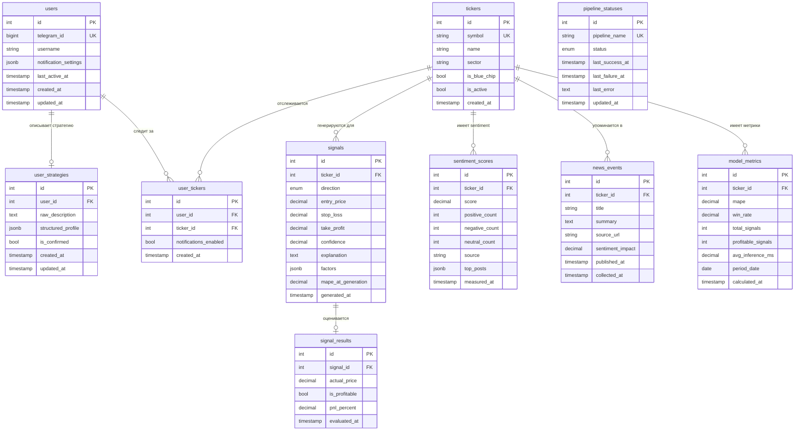

# Data Model: Trading Agent (AI-советник)

> **Версия:** 1.0
> **Дата:** 2026-03-14
> **Основано на:** Brief, USM v1.1, C4 v1.0, NFR v1.0

---

## 1. Обзор

**Всего сущностей:** 10
**Тип БД:** PostgreSQL

### Группы
- **Core:** users, user_strategies, user_tickers
- **Market Data:** tickers, sentiment_scores, news_events
- **Signals:** signals, signal_results
- **System:** pipeline_statuses, model_metrics

---

## 2. ER-диаграмма

---

## 3. Описание сущностей

### users

**Назначение:** Профиль пользователя. Минимальный набор данных — только Telegram ID.

| Поле | Тип | Null | Default | Описание |
|------|-----|------|---------|----------|
| id | BIGINT | NO | GENERATED | PK |
| telegram_id | BIGINT | NO | — | UK. Telegram user ID |
| username | VARCHAR(255) | YES | — | Telegram username (для отображения в админке) |
| notification_settings | JSONB | NO | '{}' | Настройки уведомлений: типы триггеров, периодичность |
| last_active_at | TIMESTAMP | YES | — | Последний визит (для админки) |
| created_at | TIMESTAMP | NO | NOW() | Дата регистрации |
| updated_at | TIMESTAMP | NO | NOW() | Дата обновления |

**Бизнес-правила:**
1. telegram_id уникален
2. При удалении пользователя — каскадное удаление user_strategies и user_tickers (право на удаление по 152-ФЗ)

---

### user_strategies

**Назначение:** Формализованная стратегия торговли пользователя. Хранит как исходное описание, так и структурированный профиль.

| Поле | Тип | Null | Default | Описание |
|------|-----|------|---------|----------|
| id | BIGINT | NO | GENERATED | PK |
| user_id | BIGINT | NO | — | FK → users. Один пользователь — одна активная стратегия |
| raw_description | TEXT | NO | — | Исходное описание стратегии от пользователя |
| structured_profile | JSONB | YES | — | Формализованный профиль (таймфреймы, риск, стиль) |
| is_confirmed | BOOLEAN | NO | false | Подтвердил ли пользователь профиль |
| created_at | TIMESTAMP | NO | NOW() | — |
| updated_at | TIMESTAMP | NO | NOW() | — |

**Бизнес-правила:**
1. structured_profile генерируется через Mistral API из raw_description
2. Рекомендации не учитывают стратегию, пока is_confirmed = false
3. Пользователь может перезаписать стратегию (UPDATE, не INSERT новой)

---

### tickers

**Назначение:** Справочник тикеров Московской биржи.

| Поле | Тип | Null | Default | Описание |
|------|-----|------|---------|----------|
| id | BIGINT | NO | GENERATED | PK |
| symbol | VARCHAR(20) | NO | — | UK. Тикер (SBER, GAZP, LKOH...) |
| name | VARCHAR(255) | NO | — | Полное название (Сбербанк, Газпром...) |
| sector | VARCHAR(100) | YES | — | Сектор (нефтегаз, финансы, IT...) |
| is_blue_chip | BOOLEAN | NO | false | Голубая фишка (доступна на MVP) |
| is_active | BOOLEAN | NO | true | Активен ли тикер для мониторинга |
| created_at | TIMESTAMP | NO | NOW() | — |

**Бизнес-правила:**
1. На MVP доступны только тикеры с is_blue_chip = true
2. Справочник предзаполняется при деплое

---

### user_tickers

**Назначение:** Связка пользователь ↔ тикер. Какие тикеры отслеживает пользователь.

| Поле | Тип | Null | Default | Описание |
|------|-----|------|---------|----------|
| id | BIGINT | NO | GENERATED | PK |
| user_id | BIGINT | NO | — | FK → users |
| ticker_id | BIGINT | NO | — | FK → tickers |
| notifications_enabled | BOOLEAN | NO | true | Включены ли уведомления по этому тикеру |
| created_at | TIMESTAMP | NO | NOW() | — |

**Бизнес-правила:**
1. UK на (user_id, ticker_id) — один тикер на пользователя один раз
2. Максимум 5 тикеров на пользователя (MVP), 10 (v2.0) — проверка на уровне API
3. Каскадное удаление при удалении пользователя

---

### signals

**Назначение:** Сгенерированные торговые сигналы. Основная бизнес-сущность.

| Поле | Тип | Null | Default | Описание |
|------|-----|------|---------|----------|
| id | BIGINT | NO | GENERATED | PK |
| ticker_id | BIGINT | NO | — | FK → tickers |
| direction | ENUM('BUY','SELL','HOLD') | NO | — | Направление рекомендации |
| entry_price | DECIMAL(12,4) | NO | — | Рекомендуемая цена входа |
| stop_loss | DECIMAL(12,4) | NO | — | Уровень стоп-лосса |
| take_profit | DECIMAL(12,4) | NO | — | Уровень тейк-профита |
| confidence | DECIMAL(5,4) | NO | — | Уверенность модели (0.0-1.0) |
| explanation | TEXT | NO | — | Текстовое объяснение сигнала (2-3 предложения) |
| factors | JSONB | NO | '{}' | Детали: какие факторы повлияли (sentiment, TA, news) |
| mape_at_generation | DECIMAL(8,4) | YES | — | MAPE модели на момент генерации |
| generated_at | TIMESTAMP | NO | NOW() | Время генерации |

**Бизнес-правила:**
1. Сигнал привязан к тикеру, не к пользователю (один сигнал — для всех подписчиков тикера)
2. explanation обязателен — объяснимость = ключевое требование
3. factors содержит разбивку: `{"sentiment": -0.35, "ta_rsi": 28, "news": "дивиденды отменены"}`
4. **[Tech Debt v1.1+]** На MVP сигналы не учитывают `user_strategies` — персонализация рекомендаций под стратегию пользователя запланирована на будущие версии

---

### signal_results

**Назначение:** Результат сигнала: что произошло после рекомендации.

| Поле | Тип | Null | Default | Описание |
|------|-----|------|---------|----------|
| id | BIGINT | NO | GENERATED | PK |
| signal_id | BIGINT | NO | — | FK → signals. UK |
| actual_price | DECIMAL(12,4) | NO | — | Фактическая цена через N фреймов |
| is_profitable | BOOLEAN | NO | — | Сработал ли сигнал в плюс |
| pnl_percent | DECIMAL(8,4) | NO | — | % прибыли/убытка |
| evaluated_at | TIMESTAMP | NO | NOW() | Время оценки |

**Бизнес-правила:**
1. Создаётся автоматически scheduler'ом через определённый период после сигнала
2. Используется для track record и метрик модели (журнал сигналов — v1.1)

---

### sentiment_scores

**Назначение:** Агрегированный sentiment по тикеру за период.

| Поле | Тип | Null | Default | Описание |
|------|-----|------|---------|----------|
| id | BIGINT | NO | GENERATED | PK |
| ticker_id | BIGINT | NO | — | FK → tickers |
| score | DECIMAL(5,4) | NO | — | Агрегированный скор (-1.0 до +1.0) |
| positive_count | INT | NO | 0 | Кол-во позитивных упоминаний |
| negative_count | INT | NO | 0 | Кол-во негативных |
| neutral_count | INT | NO | 0 | Кол-во нейтральных |
| source | VARCHAR(50) | NO | — | Источник: 'tpulse', 'news', 'telegram' |
| top_posts | JSONB | YES | — | Топ-3 поста/новости, повлиявших на скор |
| measured_at | TIMESTAMP | NO | NOW() | Время измерения |

**Бизнес-правила:**
1. Хранить агрегаты за последние 30 дней, старше — удалять (TTL)
2. Индекс на (ticker_id, measured_at) для быстрых запросов последнего значения

---

### news_events

**Назначение:** Значимые новости, привязанные к тикеру.

| Поле | Тип | Null | Default | Описание |
|------|-----|------|---------|----------|
| id | BIGINT | NO | GENERATED | PK |
| ticker_id | BIGINT | NO | — | FK → tickers |
| title | VARCHAR(500) | NO | — | Заголовок новости |
| summary | TEXT | YES | — | Краткое содержание (генерируется Mistral) |
| source_url | VARCHAR(1000) | YES | — | Ссылка на источник |
| sentiment_impact | DECIMAL(5,4) | YES | — | Влияние на sentiment (-1.0 до +1.0) |
| published_at | TIMESTAMP | NO | — | Время публикации |
| collected_at | TIMESTAMP | NO | NOW() | Время сбора |

**Бизнес-правила:**
1. Только значимые новости (фильтрация шума на этапе pipeline)
2. Используется для привязки к свечам (v1.1) и для explanation в сигналах

---

### pipeline_statuses

**Назначение:** Статус data pipeline'ов для админ-панели.

| Поле | Тип | Null | Default | Описание |
|------|-----|------|---------|----------|
| id | BIGINT | NO | GENERATED | PK |
| pipeline_name | VARCHAR(100) | NO | — | UK. Имя: 'data_collector', 'sentiment', 'ml_engine' |
| status | ENUM('ok','warning','error') | NO | 'ok' | Текущий статус |
| last_success_at | TIMESTAMP | YES | — | Последний успешный запуск |
| last_failure_at | TIMESTAMP | YES | — | Последний сбой |
| last_error | TEXT | YES | — | Текст последней ошибки |
| updated_at | TIMESTAMP | NO | NOW() | — |

---

### model_metrics

**Назначение:** Метрики качества модели по тикерам за период. Для админ-панели и мониторинга деградации.

| Поле | Тип | Null | Default | Описание |
|------|-----|------|---------|----------|
| id | BIGINT | NO | GENERATED | PK |
| ticker_id | BIGINT | NO | — | FK → tickers |
| mape | DECIMAL(8,4) | NO | — | MAPE за период |
| win_rate | DECIMAL(5,4) | NO | — | Win rate (0.0-1.0) |
| total_signals | INT | NO | 0 | Всего сигналов за период |
| profitable_signals | INT | NO | 0 | Прибыльных сигналов |
| avg_inference_ms | DECIMAL(10,2) | YES | — | Среднее время inference (мс) |
| period_date | DATE | NO | — | Дата периода (день) |
| calculated_at | TIMESTAMP | NO | NOW() | — |

**Бизнес-правила:**
1. Рассчитывается ежедневно scheduler'ом
2. UK на (ticker_id, period_date) — одна запись на тикер в день

---

## 4. Связи

| Связь | Тип | Описание | Каскад |
|-------|-----|----------|--------|
| users → user_strategies | 1:0..1 | Пользователь имеет 0 или 1 стратегию | CASCADE DELETE |
| users → user_tickers | 1:N | Пользователь следит за 0-5 тикерами | CASCADE DELETE |
| tickers → user_tickers | 1:N | Тикер отслеживается несколькими пользователями | RESTRICT |
| tickers → signals | 1:N | По тикеру генерируются сигналы | RESTRICT |
| signals → signal_results | 1:0..1 | Сигнал получает результат (или ещё нет) | CASCADE DELETE |
| tickers → sentiment_scores | 1:N | По тикеру хранится история sentiment | CASCADE DELETE |
| tickers → news_events | 1:N | По тикеру собираются новости | CASCADE DELETE |
| tickers → model_metrics | 1:N | По тикеру рассчитываются метрики | CASCADE DELETE |

---

## 5. Миграции (порядок)

1. **Reference:** `tickers` (справочник, предзаполнение)
2. **Core:** `users`
3. **Core:** `user_strategies`, `user_tickers` (зависят от users + tickers)
4. **Business:** `signals`, `sentiment_scores`, `news_events` (зависят от tickers)
5. **Business:** `signal_results` (зависит от signals)
6. **System:** `pipeline_statuses`, `model_metrics` (зависят от tickers)

---

## 6. Что хранится в Redis (не в PostgreSQL)

| Ключ | Тип | TTL | Описание |
|------|-----|-----|----------|
| `ohlcv:{ticker}:{timeframe}` | Time-series (LIST/ZSET) | 24h | Кэш свечей за текущий день |
| `sentiment:latest:{ticker}` | HASH | 5min | Последний sentiment-скор для быстрого доступа |
| `prediction:{ticker}` | JSON string | 15min | Кэш текущего прогноза модели |
| `ticker:card:{ticker}` | JSON string | 5min | Кэш карточки тикера (досье) |
| Celery broker | — | — | Очереди задач |
