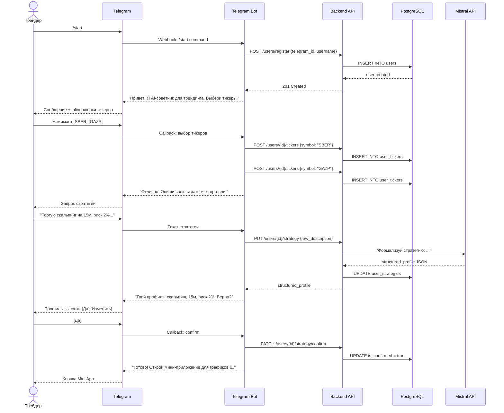
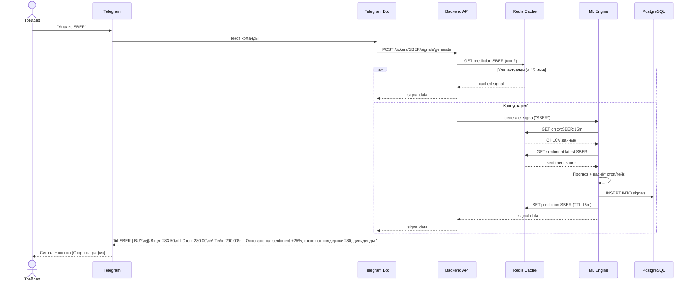
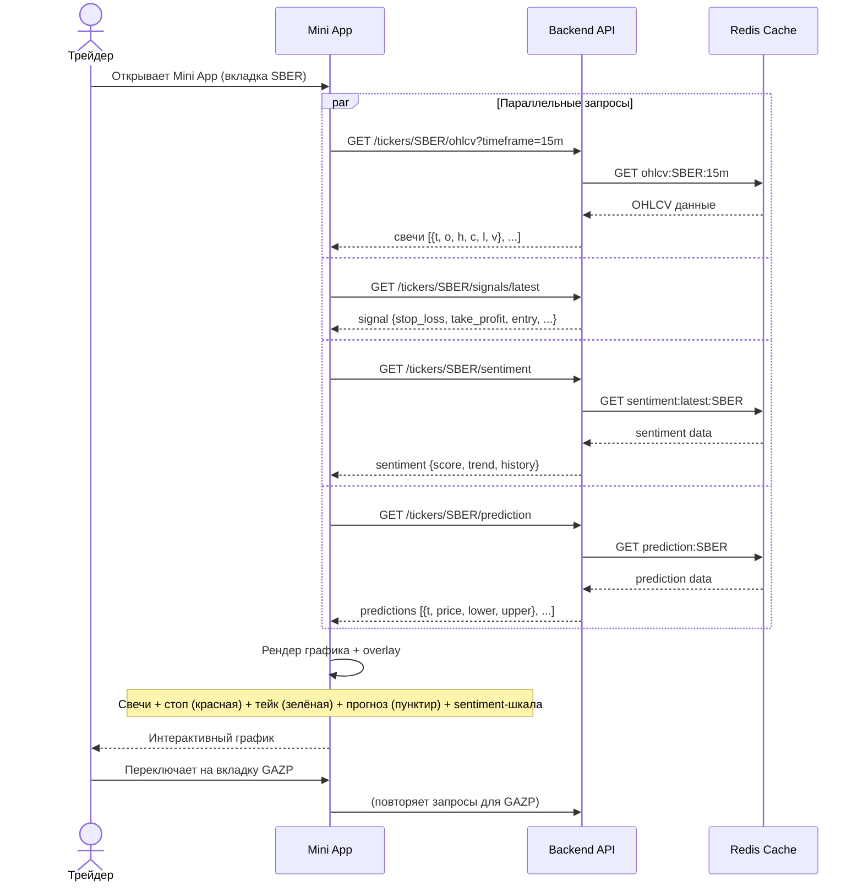
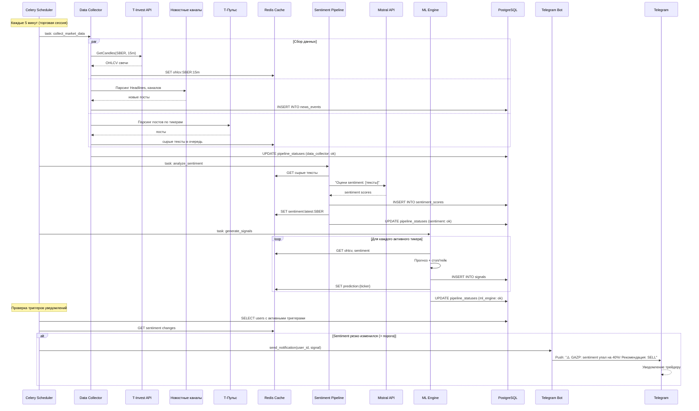
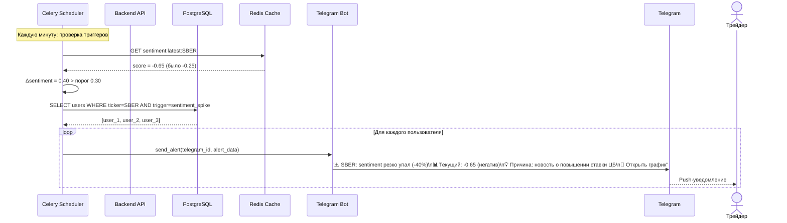
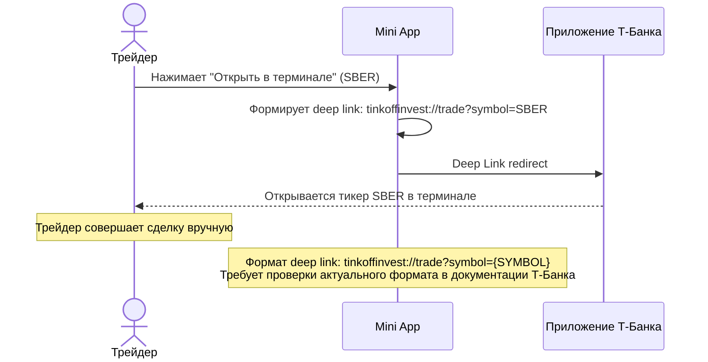
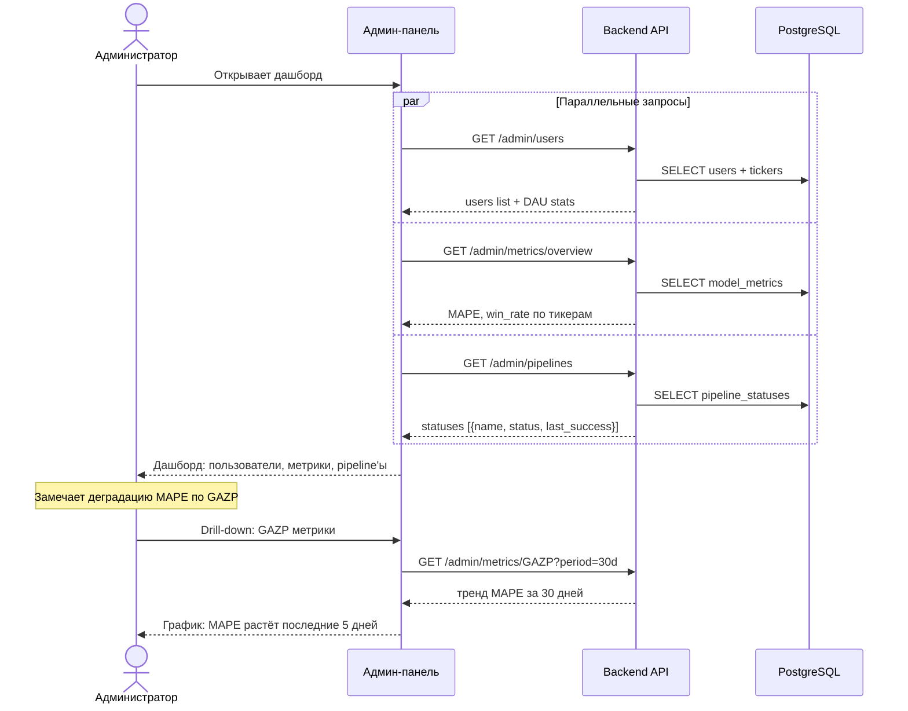
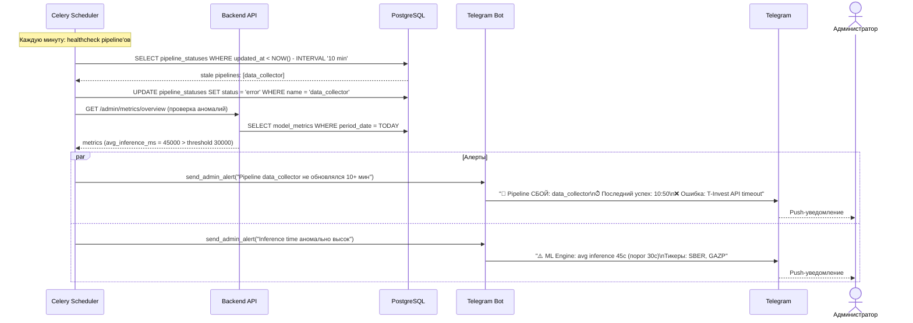

# Sequence Diagrams: Trading Agent

> **Версия:** 1.0
> **Дата:** 2026-03-14
> **Основано на:** USM v1.1, C4 v1.0, API Inventory v1.0

---

## 1. Онбординг пользователя

> US-001, US-002, US-003

---

## 2. Получение рекомендации (по запросу)

> US-007, US-008, US-009, US-016

---

## 3. Просмотр графика в Mini App

> US-010, US-011, US-012, US-013

---

## 4. Фоновый сбор данных и генерация сигналов

> SS-001, SS-002, SS-003

---

## 5. Push-уведомление по триггеру

> US-004, SS-003

---

## 6. Редирект в терминал брокера

> US-014

---

## 7. Админ-панель: мониторинг

> US-024, US-025, US-026, US-027

---

## 8. Алерт администратору при сбое

> US-027

---

## Сводка потоков

| # | Поток | Тип | Участники | Триггер |
|---|-------|-----|-----------|---------|
| 1 | Онбординг | Синхронный | Trader → Bot → API → DB → LLM | /start команда |
| 2 | Получение рекомендации | Синхронный/кэш | Trader → Bot → API → ML → Redis | Команда пользователя |
| 3 | Просмотр графика | Синхронный/кэш | Trader → Mini App → API → Redis | Открытие Mini App |
| 4 | Фоновый сбор данных | Асинхронный | Scheduler → DC → SP → ML → DB | Celery beat (каждые 5 мин) |
| 5 | Push-уведомление | Асинхронный | Scheduler → Bot → Telegram | Срабатывание триггера |
| 6 | Редирект в брокер | Клиентский | Mini App → Deep Link → Т-Банк | Кнопка пользователя |
| 7 | Админ мониторинг | Синхронный | Admin → Panel → API → DB | Открытие панели |
| 8 | Алерт администратору | Асинхронный | Scheduler → Bot → Telegram → Admin | Сбой pipeline / аномалия метрик |
